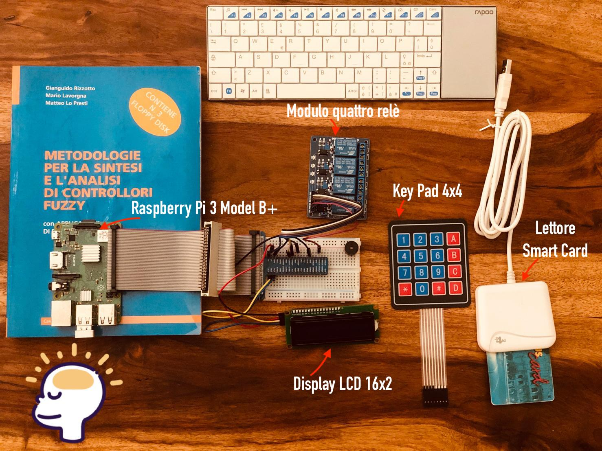
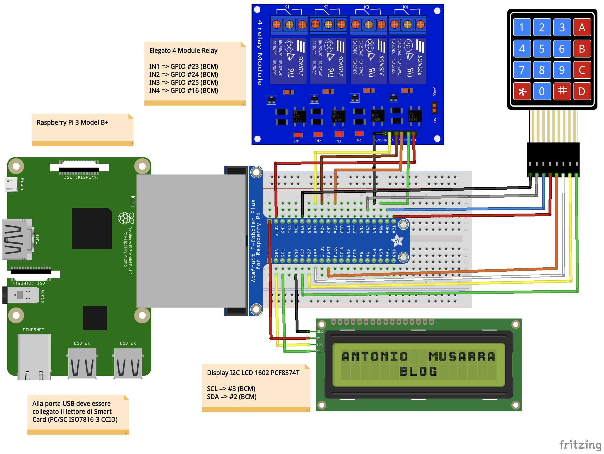
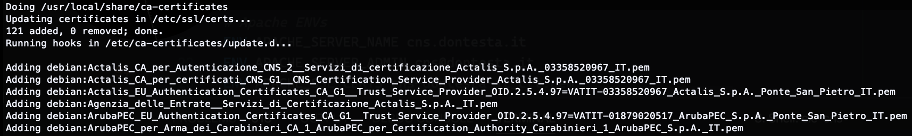
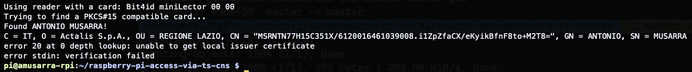
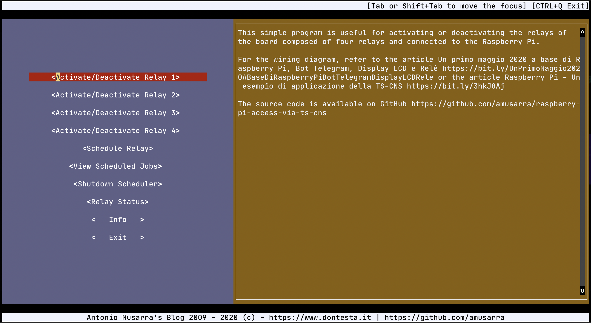
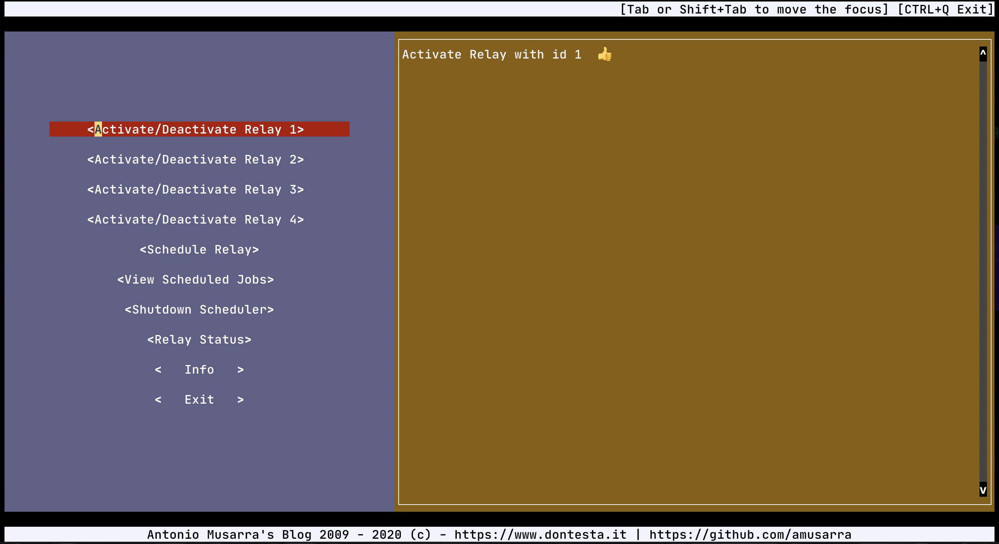
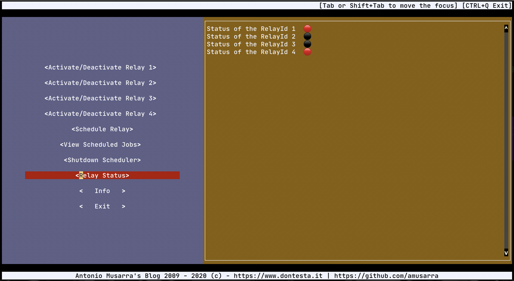
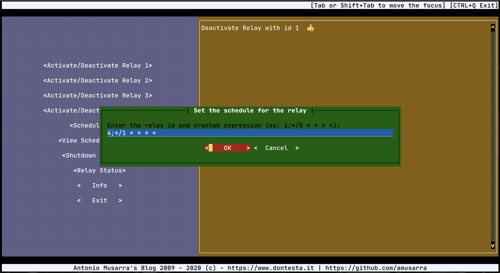
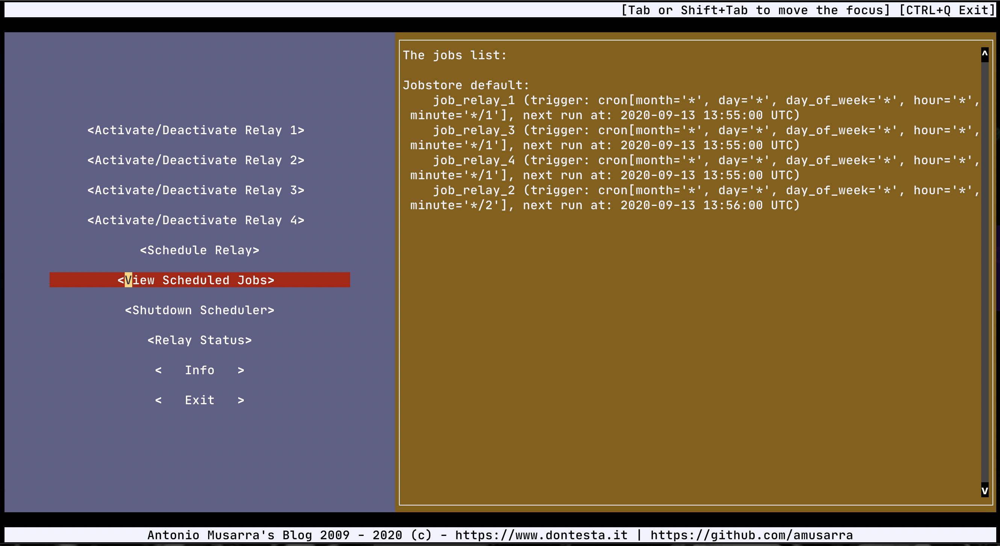
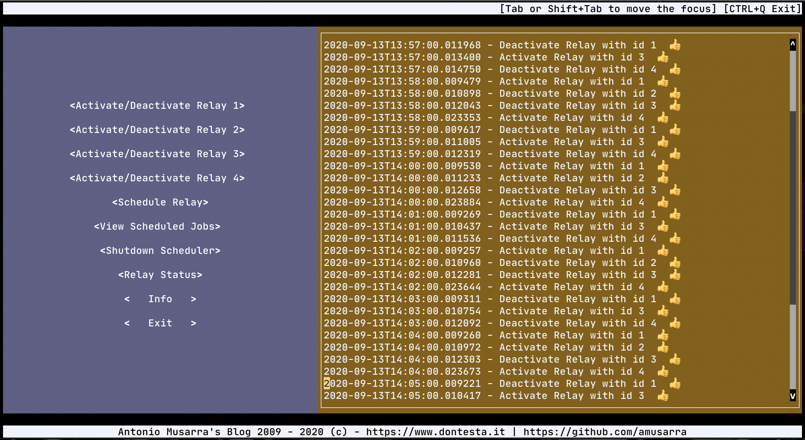

# Raspberry Pi - Un esempio di applicazione della TS-CNS

[](CHANGELOG.md)
[](https://opensource.org/licenses/MIT)
[](CODE_OF_CONDUCT.md)


Questo progetto nasce dalla composizione dei seguenti "pezzi di ferro".

1. Raspberry Pi 3 Model B+
2. Display LCD 16x2
3. Modulo quattro relè
4. Key Pad 16 caratteri (4x4)
5. Lettore Smart Card Bit4id

Recentemente ho utilizzato il display LCD e il modulo da quattro relè nel
progetto [Un primo maggio 2020 a base di Raspberry Pi, Bot Telegram, Display LCD e Relè](https://bit.ly/UnPrimoMaggio2020ABaseDiRaspberryPiBotTelegramDisplayLCDRele)
che vi invito a leggere.

L'articolo [Raspberry Pi – Un esempio di applicazione della TS-CNS](https://bit.ly/3hkJ8Aj) pubblicato sul
mio blog e che invito a leggere, è il riferimento per questo progetto.

Quelli che vedete nella figura a seguire sono i componenti utilizzati (a meno della tastiera).



Figura 1 - Componenti del progetto

L’idea alla base della “ricetta” è quella di realizzare un sistema di sicurezza 
tale per cui è possibile attivare una serie di relè solo dopo che l'utilizzare del sistema
esegua con successo l'autenticazione tramite la propria TS-CNS (Tessera Sanitaria - 
Carta Nazionale dei Servizi). Sul sito dell'[Agenzia per l'Italia digitale (AgID)](https://www.agid.gov.it/it/piattaforme/carta-nazionale-servizi)
sono pubblicate tutte le informazioni di dettaglio sulla **Carta Nazionale dei Servizi**.

Sul mio canale YouTube Antonio Musarra's Blog, è disponibile un breve video che mostra
quello che si può realizzare con un Raspberry Pi, un lettore di Smart Card, un Key Pad 4x4, 
un modulo da quattro relè, un display LCD 16x2 e la propria TS-CNS (Tessera Sanitaria - 
Carta Nazionale dei Servizi).


[](https://www.youtube.com/watch?v=_lOdD6tjSDo)

## 1. Schema elettrico della soluzione
Dando per scontato che abbiate tutto il materiale hardware a vostra disposizione (vedi capitolo 2. Requisiti), possiamo 
disporre tutti collegamenti tra i vari componenti hardware che compongono la soluzione, così come indicato dallo schema 
elettrico mostrato a seguire.

Al fine di facilitare i collegamenti ho indicato nelle note quali sono i pin (BCM) che ogni componente 
utilizzerà. Per quanto riguarda il layout del connettore J8 del Raspberry PI, fate riferimento alla 
documentazione ufficiale su [GPIO (general-purpose input/output)](https://www.raspberrypi.org/documentation/usage/gpio/).




Figura 2 - Schema elettrico della soluzione


## 2. Requisiti
Per raggiungere l'obiettivo abbiamo bisogno di raccogliere un pochino di materiale, dobbiamo fare una sorta di lista 
della spesa, sia in termini hardware, sia in termini software. Partiamo dal basso, con la lista dell’hardware.

1. [**Raspberry Pi**](https://amzn.to/2KX1ybU): ho utilizzato la versione 3 Model B+ 
che sarà il riferimento di questo articolo. Per coloro che hanno a disposizione 
il [Raspberry Pi 2](https://amzn.to/35rsKJf) o il [Raspberry Pi 4](https://amzn.to/35vh4FE), 
non dovrebbe essere un problema.
2. [**Modulo Relè**](https://amzn.to/3b2zpLc): ho utilizzato il modello Elegoo 4 Channel 
DC 5V Modulo Relay con Accoppiatore Ottico. A quanto pare è difficile trovare questo modello, 
al suo posto, anche su Amazon, è stato sostituito con il modulo da otto. In ogni caso per 
questo esperimento va benissimo anche il modulo con due o al peggio un solo Relè.
3. [**Display LCD**](https://amzn.to/2KRkiK5): ho utilizzato un display LCD I2C 1602 16X2.
4. [**Key Pad 16 caratteri (4x4)**](https://amzn.to/2V5UgIg): ho scelto questo tastierino
con lettere e caratteri "speciali" per un motivo che vedremo dopo.
5. [**Breadboard**](https://amzn.to/2SsrX5t), [**GPIO Extender**](https://amzn.to/3fd8eRa), [**Cavi Maschio a Femmina Dupont**](https://amzn.to/3bYFo5b) e [**Cavi Maschio a Maschio Dupont**](https://amzn.to/3drg1c7) utilizzati per 
realizzare i collegamenti tra il Raspberry Pi, il modulo LCD, il modulo Relè e il Key Pad.

Tutti i componenti hardware possono essere acquisitati separatamente, però, se l’argomento vi appassiona, consiglio 
l’acquisito dello Starter Kit Freenove RFID per Raspberry Pi. All’interno del kit sono inclusi gli ultimi elementi 
della nostra lista, oltre ad altri numerosi componenti.

Per quanto riguarda il software abbiamo bisogno di:

1. [**Raspbian OS**](https://www.raspberrypi.org/downloads/raspbian/): a meno di applicazioni 
particolari, questo sistema operativo basato su Debian è ottimizzato per la piattaforma Raspberry Pi. 
L’ultima versione disponibile è **Raspbian Buster**. Sul mio Raspberry Pi 3 B+ ho installato 
quest’ultima release. Per maggiori informazioni sull’installazione del sistema operativo, fare 
riferimento alla guida ufficiale ([Installing operating system images](https://www.raspberrypi.org/documentation/installation/installing-images/README.md)). Questo sarà comunque il 
sistema operativo di riferimento.
2. **Python 3.x**: sul mio Raspberry Pi ho installato sia la versione 2.7 (quella di default) 
sia la versione 3.7, quest’ultima disponibile OOTB con l’ultima versione di Raspbian OS.
3. [**pad4pi**](https://pypi.org/project/pad4pi/): modulo Python per la gestione del Key Pad.
4. **Moduli software display LCD**: moduli Python per utilizzare il display LCD. Utilizzeremo 
i moduli scritti da [Freenove](http://www.freenove.com/) e reperibili dal loro repository [GitHub](https://github.com/Freenove/Freenove_Ultimate_Starter_Kit_for_Raspberry_Pi).
5. **PC/SC Middleware**: Middleware per la gestione e comunicazione per le Smart Card e Smart
Card Reader.
6. [**OpenSC**](https://github.com/OpenSC/OpenSC/wiki): OpenSC fornisce una serie di librerie 
e utilità per lavorare con le smart card. Il suo focus principale è sulle schede che supportano 
le operazioni crittografiche e ne facilitano l'uso in applicazioni di sicurezza come 
l'autenticazione, la crittografia della posta e le firme digitali. OpenSC implementa le API 
standard su smart card, ad es. API PKCS#11, Minidriver per smart card di Windows e macOS 
CryptoTokenKit.


Possiamo verificare che il software attualmente installato sia conforme ai requisiti accedendo 
alla console del Raspberry Pi ed eseguendo i comandi a seguire.

```bash
# Verifica della Release del Sistema Operativo 
cat /etc/os-release
 
# Verifica della Release del Kernel
uname -a
```

A seguire è mostrato l’output dei comandi precedenti eseguiti sul mio Raspberry Pi.

```bash
# Output del comando cat /etc/os-release
PRETTY_NAME="Raspbian GNU/Linux 10 (buster)"
NAME="Raspbian GNU/Linux"
VERSION_ID="10"
VERSION="10 (buster)"
VERSION_CODENAME=buster
ID=raspbian
ID_LIKE=debian
HOME_URL="http://www.raspbian.org/"
SUPPORT_URL="http://www.raspbian.org/RaspbianForums"
BUG_REPORT_URL="http://www.raspbian.org/RaspbianBugs"
 
# Output del comando uname -a
Linux amusarra-rpi 4.19.97-v7+ #1294 SMP Thu Jan 30 13:15:58 GMT 2020 armv7l GNU/Linux
```

Per quanto concerne la versione di Python, a meno di casi particolari, su Raspbian OS 
dovrebbero essere installate due release di Python, la 2.x e la 3.x. La specifica 
minor version dipende dalla versione del sistema operativo. Nel caso di Raspbian OS Buster 
le versioni esatte sono:

1. Python 2.7.16 (attiva per default)
2. Python 3.7.3

Sul mio Raspberry Pi ho reso di default la versione 3.7.3 di Python, visto che questa 
è la versione richiesta per il corretto funzionamento del Bot che andremo a realizzare. 
Per rendere l’ultima versione di Python di default, è più che sufficiente aggiungere i 
seguenti alias su file ~/.bashrc

```bash
alias python='/usr/bin/python3'
alias pip=pip3
```

Una volta concluse le verifiche che riguardano Python, possiamo passare all'installazione
del resto dei componenti software.

```bash
sudo pip install pad4pi
sudo apt-get install pcscd
sudo apt-get install libccid
sudo apt-get install opensc
```

A questo punto, che i requisiti hardware e software di base sono soddisfatti, vediamo
com'è strutturato il progetto software.


# 3. Organizzazione del progetto
Il progetto è così organizzato.

1. **modules**: questa directory contiene i moduli Python per l'utilizzo del display LCD 16x2
        a. PCF8574.py: modulo per la gestione del bus i2c
        b. Adafruit_LCD1602.py: funzioni ad alto livello per le operazioni sul display LCD
2. **scripts**: questa directory contiene lo script Python **parse-gov-certs.py** il cui scopo 
è il download dei certificati Governativi Italiani, e lo script bash **auto-update-gov-certificates.sh**
il cui scopo è aggiungere sul sistema i certificati Governativi Italiani
3. **test_keypad_pin_lcd.py**: script Python per il test del funzionamento del Key Pad
4. **verify_ts_cns_pin.py**: script Python per la verifica del codice PIN sulla TS-CNS
5. **activate_relay_via_pin_code.py**: script Python che permette l'attiviazione dei relè inserendo
il codice PIN (1234), senza quindi interazione con la TS-CNS.
6. **activate_relay_via_ts_cns_pin.py**: script Python che permette l'attivazione dei relè inserendo
il codice PIN della TS-CNS.

Gli script **verify_ts_cns_pin.py** e **activate_relay_via_ts_cns_pin.py** sono quelli che
interagiscono con il lettore di Smart Card e la TS-CNS. Il resto degli script sono per fare il test sulla
corretta funzionalità del Key Pad e Relè, e accertarsi quindi che i collegamenti tra i vari
componenti stiano funzionando correttamente.

# 4. Quick start
Supponendo che abbiate montato tutto secondo lo schema elettrico indicato e che il vostro Raspberry Pi 
sia connesso alla rete, possiamo procedere con i seguenti step.

1. Accesso al Raspberry Pi via SSH o direttamente dal console. Consiglio di accedere con utenza 
diversa da root
2. Clonazione del repository amusarra/raspberry-pi-access-via-ts-cns
3. Aggiornamento dei certificati di sistema
4. Esecuzione del test


```bash
cd --
git clone https://github.com/amusarra/raspberry-pi-access-via-ts-cns.git
cd  raspberry-pi-access-via-ts-cns
cd scripts
sudo ./auto-update-gov-certificate.sh
```

La figura a seguire mostra l'output che dovreste ottenere eseguendo lo script che aggiunge i
certificati Governativi Italiani al sistema.



Figura 3 - Aggiunta dei certificati governativi al sistema


L'aggiunta dei certificati Governativi Italiani al sistema è importante ai fini della validazione
del certificato digitale presente sulla TS-CNS. Nel caso questa operazione non venisse eseguita,
il processo di autenticazione non andrà mai a buon fine, anche nel caso in cui il PIN inserito
fosse corretto.


Figura 4 - Errore di validazione del certificato digitale


A questo punto è tutto pronto per iniziare i test di funzionamento della soluzione. Consiglio di
procedere con l'esecuzione degli script Python, con lo stesso ordine mostrato nel capitolo
_3. Organizzazione del progetto_. Per eseguire gli script sarà sufficiente utilizzare la sintassi
`./nome_script_python.py`.

# 5. Script bonus
All'interno del progetto c'è lo script Python ``manage_relay_tui.py``. Ho realizzato questo script
per rispondere ad alcune domande poste dai lettori del mio blog.

Questo script Python, grazie ad una Text-based User Interface, consente di:

1. attivare e disattivare i quattro relè del modulo utilizzato in questo progetto. Fare rifermento
allo schema elettrico della soluzione;
2. verificare lo stato di ogni relè (in questo caso sono quattro);
3. impostare una programmazione di attivazione e disattivazione per ogni relè del modulo;
4. modificare le programmazioni di attivazione e disattivazione esistenti;
5. verificare le programmazioni impostate;
6. eseguire lo stop di tutte le programmazioni.

Per poter eseguire questo script è necessario installare i seguenti pacchetti Python:

1. [Python Prompt Toolkit 3.0](https://python-prompt-toolkit.readthedocs.io/en/master/) >= 3.0
2. [Advanced Python Scheduler](https://apscheduler.readthedocs.io/en/stable/index.html) >= 3.6.3
3. [Python PID](https://pypi.org/project/pid/) >= 3
4. [Emoji for Python](https://pypi.org/project/emoji/) >= 0.6.0

L'installazione dei pacchetti Python avviene sempre utilizzando il comando ``pip`` così' come indicato
sulla documentazione di ogni pacchetto. A seguire sono mostrati i comandi per l'installazione dei
pacchetti richiesti dallo script.


```bash
sudo pip install prompt_toolkit
sudo pip install apscheduler
sudo pip install pid
sudo pip install emoji --upgrade
```

Una volta installate tutte le dipendenze, è possibile eseguire lo script, utilizzando il comando
``./manage_relay_tui.py`` e dovreste visualizzare quando mostrato dalla figuara a seguire.



Figura 5 - Home Screen dello script Python manage_relay_tui.py

Le figure a seguire mostrano le schermate dell'applicazione che rappresentano le funzionalità indicate
in precedenza.



Figura 6 - Attivazione Relay 1




Figura 7 - Visualizzazione dello stato dei relè




Figura 8 - Schedulazione job per attivazione/disattivazione relè




Figura 9 - Visualizzazione dei Job attivi




Figura 10 - Visualizzazione attività dei Job programmati

Lo script scrive alcune informazioni utili sul file di log `manage_relay_tui.log` che sono mostrate a 
seguire.

```bash
2020-09-13 13:46:41,520 :: DEBUG :: check :: 181 :: <pid.posix.PidFile object at 0xffff80890940> check pidfile: /run/user/1001/manage_relay_tui.py.pid
2020-09-13 13:46:41,521 :: DEBUG :: __init__ :: 59 :: Using selector: EpollSelector
2020-09-13 13:53:36,016 :: INFO :: scheduler_add_job :: 323 :: Schedule Settings: 4;*/1 * * * *
2020-09-13 13:53:36,017 :: INFO :: scheduler_add_job :: 331 :: Relay Id: 4
2020-09-13 13:53:36,017 :: INFO :: scheduler_add_job :: 332 :: Cron Expression: */1 * * * * for Relay Id: 4
2020-09-13 13:53:36,018 :: INFO :: add_job :: 440 :: Adding job tentatively -- it will be properly scheduled when the scheduler starts
2020-09-13 13:53:36,018 :: INFO :: scheduler_add_job :: 346 :: Starting Scheduler...
2020-09-13 13:53:36,023 :: INFO :: _real_add_job :: 881 :: Added job "job_relay_4" to job store "default"
2020-09-13 13:53:36,023 :: INFO :: start :: 166 :: Scheduler started
2020-09-13 13:53:36,024 :: INFO :: scheduler_add_job :: 349 :: Scheduler Started
2020-09-13 13:53:50,142 :: INFO :: scheduler_add_job :: 323 :: Schedule Settings: 1;*/1 * * * *
2020-09-13 13:53:50,142 :: INFO :: scheduler_add_job :: 331 :: Relay Id: 1
2020-09-13 13:53:50,143 :: INFO :: scheduler_add_job :: 332 :: Cron Expression: */1 * * * * for Relay Id: 1
2020-09-13 13:53:50,145 :: INFO :: _real_add_job :: 881 :: Added job "job_relay_1" to job store "default"
2020-09-13 13:54:00,002 :: INFO :: run_job :: 123 :: Running job "job_relay_1 (trigger: cron[month='*', day='*', day_of_week='*', hour='*', minute='*/1'], next run at: 2020-09-13 13:54:00 UTC)" (scheduled at 2020-09-13 13:54:00+00:00)
2020-09-13 13:54:00,005 :: INFO :: run_job :: 123 :: Running job "job_relay_4 (trigger: cron[month='*', day='*', day_of_week='*', hour='*', minute='*/1'], next run at: 2020-09-13 13:54:00 UTC)" (scheduled at 2020-09-13 13:54:00+00:00)
2020-09-13 13:54:00,005 :: INFO :: run_job :: 144 :: Job "job_relay_1 (trigger: cron[month='*', day='*', day_of_week='*', hour='*', minute='*/1'], next run at: 2020-09-13 13:55:00 UTC)" executed successfully
2020-09-13 13:54:00,007 :: INFO :: run_job :: 144 :: Job "job_relay_4 (trigger: cron[month='*', day='*', day_of_week='*', hour='*', minute='*/1'], next run at: 2020-09-13 13:55:00 UTC)" executed successfully
2020-09-13 13:54:00,128 :: INFO :: scheduler_add_job :: 323 :: Schedule Settings: 2;*/2 * * * *
2020-09-13 13:54:00,129 :: INFO :: scheduler_add_job :: 331 :: Relay Id: 2
2020-09-13 13:54:00,129 :: INFO :: scheduler_add_job :: 332 :: Cron Expression: */2 * * * * for Relay Id: 2
2020-09-13 13:54:00,130 :: INFO :: _real_add_job :: 881 :: Added job "job_relay_2" to job store "default"
2020-09-13 13:54:12,122 :: INFO :: scheduler_add_job :: 323 :: Schedule Settings: 3;*/1 * * * *
2020-09-13 13:54:12,122 :: INFO :: scheduler_add_job :: 331 :: Relay Id: 3
2020-09-13 13:54:12,123 :: INFO :: scheduler_add_job :: 332 :: Cron Expression: */1 * * * * for Relay Id: 3
2020-09-13 13:54:12,125 :: INFO :: _real_add_job :: 881 :: Added job "job_relay_3" to job store "default"
2020-09-13 13:55:00,003 :: INFO :: run_job :: 123 :: Running job "job_relay_1 (trigger: cron[month='*', day='*', day_of_week='*', hour='*', minute='*/1'], next run at: 2020-09-13 13:56:00 UTC)" (scheduled at 2020-09-13 13:55:00+00:00)
```

Sul mio canale YouTube ho pubblicato il video tutorial [Gestire un modulo relè collegato al Raspberry Pi con Python tramite una Text-based User Interface](https://youtu.be/GQvPyOEMy9c)
che descrive nel dettaglio le funzionalità implementate dallo script Python. 
[](https://www.youtube.com/watch?v=GQvPyOEMy9c)

## 6. Script per la lettura dei dati personali dalla TS-CNS

All'interno del progetto è disponibile lo script Python `read-ts-cns-data.py` che consente di leggere i dati personali contenuti nella Tessera Sanitaria - Carta Nazionale dei Servizi (TS-CNS).

Lo script invia comandi APDU specifici alla Smart Card per recuperare informazioni come nome, cognome, codice fiscale, data di nascita e altri dati personali memorizzati nella tessera.

Per approfondimenti sull TS-CNS e sulla sua architettura, è possibile consultare la [documentazione ufficiale](https://www.agid.gov.it/it/piattaforme/carta-nazionale-servizi).

### Prerequisiti di sistema:
- Raspberry Pi: vedere la sezione [2. Requisiti](#2-requisiti)
- macOS: librerie di sviluppo PCSC
- Linux: pacchetto pcscd e librerie di sviluppo
- Windows: driver per il lettore di Smart Card

### Requisiti e installazione

Per eseguire lo script sono necessari i seguenti prerequisiti:

- pyscard: libreria per la comunicazione con Smart Card
- colorama: per la colorazione del testo nel terminale

È possibile installare le dipendenze Python con il comando:

```bash
pip install pyscard colorama
```

### Utilizzo

Per utilizzare lo script è sufficiente eseguirlo con Python:

```bash
python read-ts-cns-data.py         # Esecuzione normale
python read-ts-cns-data.py --debug # Modalità debug con informazioni dettagliate
```

In modalità normale, lo script mostrerà i dati personali estratti dalla carta. Con l'opzione `--debug` verranno visualizzate informazioni aggiuntive come i dettagli sulla connessione, l'ATR (Answer To Reset) della smart card e una rappresentazione esadecimale dei dati grezzi.

Lo script è in grado di leggere informazioni come:
- Nome e cognome
- Codice fiscale
- Data di nascita
- Comune di nascita
- Sesso
- Altri dati disponibili sulla carta

A seguire un esempio di output dello script:

```bash
🔍 Lettori disponibili: ['BIT4ID miniLector EVO']
🔍 Usando il lettore: BIT4ID miniLector EVO
✅ Connessione alla smart card stabilita
🔍 ATR: 3B FF 18 00 00 81 31 FE 45 00 6B 05 05 20 00 01 21 01 43 4E 53 10 31 80 79
🔍 Inviando APDU: [0, 164, 0, 0, 2, 63, 0]
🔍 Risposta:  SW1=90, SW2=00
✅ MF selezionato con successo
🔍 Inviando APDU: [0, 164, 0, 0, 2, 17, 0]
🔍 Risposta:  SW1=90, SW2=00
✅ DF selezionato con successo
🔍 Inviando APDU: [0, 164, 0, 0, 2, 17, 2]
🔍 Risposta:  SW1=90, SW2=00
✅ EF selezionato con successo
🔍 Inviando APDU: [0, 176, 0, 0, 0]
🔍 Risposta: <HEX-DATA> SW1=90, SW2=00
✅ Dati letti con successo
✅ Dati letti dalla Smart Card:
Esadecimale:
<HEX-DATA>
Dati decodificati:
  Emettitore: 6120
  Data emissione: 28/03/2023
  Data scadenza: 27/03/2029
  Cognome: MUSARRA
  Nome: ANTONIO
  Data nascita: 15/07/1980
  Sesso: M
  Codice fiscale: MSRNTN80I15B202X
  Comune nascita: B202
✅ Disconnessione dalla smart card completata
```

Se non viene rilevato un lettore di smart card o se non è presente una TS-CNS nel lettore, lo script mostrerà un messaggio di errore appropriato.